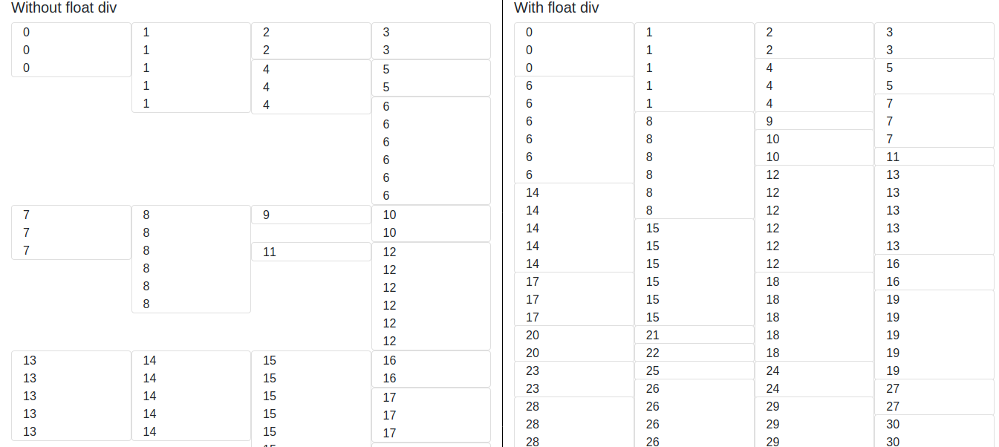

# float-div

float-div is an npm package to make div "float" as shown below.


## Installation

- With NPM
```bash
$ npm install float-div
```
- Without NPM

Download the source code on: https://github.com/Lenny4/float-div

Then you will need to execute
```bash
$ cd float-div
$ npm run build
```
the distribution source file will be available in `./float-div/dist/float-div.js`
You can require it like that:
```html
<script src="float-div/dist/float-div.js"></script>
```

## Warning
The full signature of `floatDiv` is `floatDiv(selector, animation = 400, gridWidth = 12, reloadFloat = [0, 576, 768, 992, 1200])`
- selector: the container selector to execute FloatDiv
- animation: animationTime to fadeIn element (if no animation then set animation to `null`)
- gridWidth: this plugin is based on a grid system of 12 columns (bootstrap default grid system)
if you use another lib than bootstrap with a different grid system then change this parameter
- reloadFloat: corresponds of all the sizes of the window where the disposition of the div might change,
by default we use the bootstrap option (https://getbootstrap.com/docs/4.0/layout/grid/#grid-options)

## Usage
- With bootstrap
```html
<div class="float-div position-relative">
    <div class="card col-12 col-md-3">0<br/>0<br/>0</div>
    <div class="card col-12 col-md-3">1<br/>1<br/>1<br/>1<br/>1</div>
    <div class="card col-12 col-md-3">2<br/>2</div>
    <div class="card col-12 col-md-3">3<br/>3</div>
    <div class="card col-12 col-md-3">4<br/>4<br/>4</div>
</div>
<script src="../dist/float-div.js"></script>
<script>
    floatDiv('.float-div');
</script>
```
##### If you used NPM to install the package
```html
<div class="float-div position-relative">
    <div class="card col-12 col-md-3">0<br/>0<br/>0</div>
    <div class="card col-12 col-md-3">1<br/>1<br/>1<br/>1<br/>1</div>
    <div class="card col-12 col-md-3">2<br/>2</div>
    <div class="card col-12 col-md-3">3<br/>3</div>
    <div class="card col-12 col-md-3">4<br/>4<br/>4</div>
</div>
```
```javascript
const floatDiv = require('float-div');
floatDiv('.float-div');
```
- Without bootstrap (same result)
```html
<div class="float-div position-relative">
    <div class="card" style="width: 25%">0<br/>0<br/>0</div>
    <div class="card" style="width: 25%">1<br/>1<br/>1<br/>1<br/>1</div>
    <div class="card" style="width: 25%">2<br/>2</div>
    <div class="card" style="width: 25%">3<br/>3</div>
    <div class="card" style="width: 25%">4<br/>4<br/>4</div>
</div>
```

All div in `.float-div` must have the same width.
This will not work:
```html
<div class="float-div position-relative">
    <div class="card col-md-3">0<br/>0<br/>0</div>
    <div class="card col-md-4">1<br/>1<br/>1<br/>1<br/>1</div>
    <div class="card col-md-5">2<br/>2</div>
    <div class="card col-md-3">3<br/>3</div>
    <div class="card col-md-3">4<br/>4<br/>4</div>
</div>
```

## Contributing
Pull requests are welcome.

## Report a bug
https://github.com/Lenny4/float-div/issues

## License
[MIT](https://choosealicense.com/licenses/mit/)